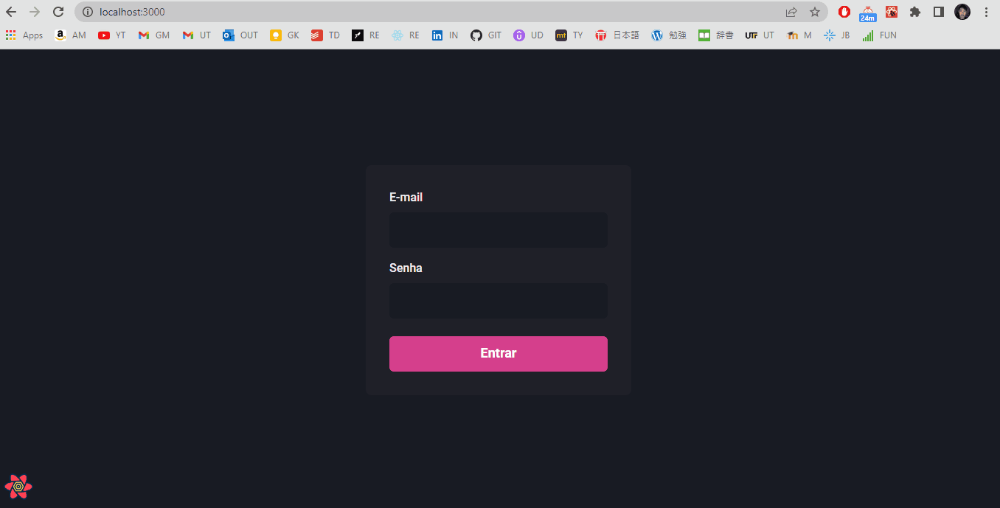
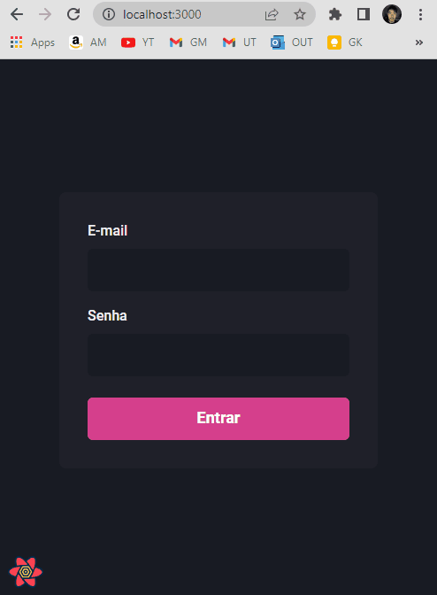

<section align="center">
    
</section>

---

<h2 align="center">Summary</h2>

<p align="center">
    <a href="#about">📙 About</a>
    <a href="#preview">🖼️ Preview</a>
    <a href="#start">📖 How to Start</a>
    <a href="#features">💡 Features</a>
    <a href="#technologies">💻 Technologies</a>
</p>

<h4 align="center">
   ✔️ Dashgo project finished ✔️
</h4>

<H2 id="about">📙 About</H2>

<p>Dashgo is an application implemented using Nextjs and has useful features such as form authentication, data prefetching and pagination component. It's completely styled using declarative interface from Chakra UI.</p>
<p>Responsive layout and mobile version are available on this application, with addiction of a mobile sidebar as well.</p>
<p>This project is originally created on Ignite from <a href="https://www.rocketseat.com.br/">Rocketseat</a> and made by <a href="https://www.linkedin.com/in/kleverson-kenji-iwatani/">Kenji Iwatani</a></p>

---

<h2 id="preview">🖼️ Preview</h2>

<h3>Desktop</h3>

<section align="center">
    
</section>

<h3>Mobile</h3>

<section align="center">
    
</section>

---

<H2 id="start">📖 How to Start</H2>

<h3>Starting this repository:</h3>

```bash
# Clone this repository
$ git clone https://github.com/iwataniKenji/dashgo

# Access the project directory
$ cd dashgo

# Install dependencies
$ yarn

# Initialize and open local host
$ yarn dev
```

---

<H2 id="features">💡 Features</H2>

- [x] Responsive layout with mobile sidebar
- [x] Highlight on active link
- [x] Authentication form for email and password confirmation
- [x] Data validation on sign in page
- [x] Authentication when creating new user
- [x] Factories and seeds to create fake users
- [x] Pagination with conditional checker for previous and next page
- [x] User list data prefetch using cache

---

<H2 id="technologies">💻 Technologies</H2>

- [x] <a href="https://nextjs.org/">Next.js</a>
- [x] <a href="https://reactjs.org/">React</a>
- [x] <a href="https://www.typescriptlang.org/">Typescript</a>
- [x] <a href="https://sass-lang.com/">SASS</a>
- [x] <a href="https://chakra-ui.com/">Chakra UI</a>
- [x] <a href="https://apexcharts.com/">Apex Charts</a>
- [x] <a href="https://react-query.tanstack.com/">React Query</a>
- [x] <a href="https://miragejs.com/">Miragejs</a>
- [x] <a href="https://react-hook-form.com/">React Hook Form</a>
